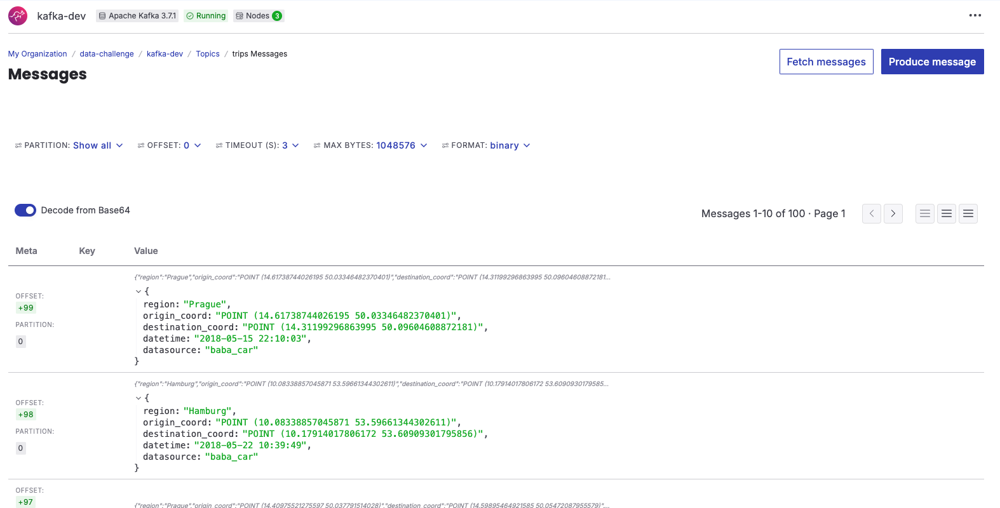
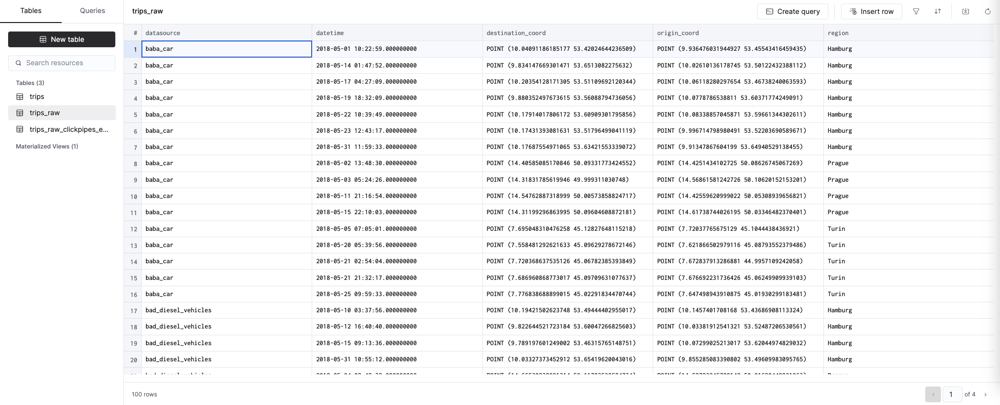
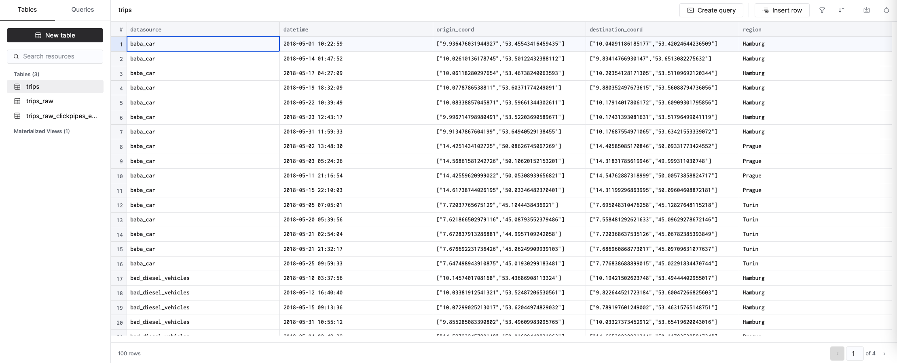

# Data Ingestion

This project is designed to enable the seamless ingestion and processing of data from multiple producers. It is structured into four key components.

## 1. App

The application was built to receive and process requests without token-based authentication. However, to improve security, we plan to implement authentication in the future. This API can be also deployed on any cloud provider, enabling horizontal scalability to accommodate increasing demands.

### Weekly average

Get the weekly average number of trips. Currently, filtering options include region, destination coordinates, and origin coordinates.

```sh
GET http://localhost:8000/trips/getAverage?f_region=Prague

GET http://localhost:8000/trips/getAverage?f_destination=((0.0,0.0)(100.0,100.0))

GET http://localhost:8000/trips/getAverage?f_origin=((0.0,0.0)(100.0,100.0))
```

```json
{
    "weeklyAverage": {
        "2018-17": 3.6,
        "2018-18": 2.857142857142857,
        "2018-19": 2.857142857142857,
        "2018-20": 3.857142857142857,
        "2018-21": 3.75
    }
}
```

### Common areas

Get most common trips areas. Currently, filtering options include region, destination coordinates, and origin coordinates.

```sh
GET http://localhost:8000/trips/getCommonAreas?f_region=Prague

GET http://localhost:8000/trips/getCommonAreas?f_destination=((0.0,0.0)(100.0,100.0))

GET http://localhost:8000/trips/getCommonAreas?f_origin=((0.0,0.0)(100.0,100.0))
```

```json
{
    "commonAreas": [
        {
            "region": "Prague",
            "origin_area": "14.4-50",
            "destination_area": "14.4-50",
            "trips": 29
        },
        {
            "region": "Prague",
            "origin_area": "14.3-50",
            "destination_area": "14.4-50",
            "trips": 21
        }
    ]
}

```

### Register trips

This endpoint is used to record trips. It receives a JSON containing a list of trips for processing.

```sh
POST http://localhost:8000/trips
```

```json
[
    {
        "region": "Prague",
        "origin_coord": "POINT (14.4973794438195 50.00136875782316)",
        "destination_coord": "POINT (14.4973794438195 50.00136875782316)",
        "datetime": "2018-05-28 09:03:40",
        "datasource": "funny_car"
    },
    {
        "region": "Prague",
        "origin_coord": "POINT (14.4973794438195 50.00136875782316)",
        "destination_coord": "POINT (14.4973794438195 50.00136875782316)",
        "datetime": "2018-05-28 09:03:40",
        "datasource": "funny_car"
    }
]
```

## 2. Uploader

For convenience, an uploader is provided to upload CSV files of any size. It also shows the number of rows that have been loaded.

```sh
usage: uploader [-h] -p, --path PATH [--domain DOMAIN] [--port PORT] [--chunksize N]

Process args to run file uploader.

optional arguments:
  -h, --help       show this help message and exit
  -p, --path PATH  the file path to be uploaded
  --domain DOMAIN  the domain to be uploaded
  --port PORT      the port to be uploaded
  --chunksize N    the payload size
```

```sh
$ python uploader -p trips.csv
Uploading data
Lines uploaded: 10
Lines uploaded: 20
Lines uploaded: 30
```

## 3. Kafka

Kafka is a distributed event streaming platform designed for high-throughput, real-time data ingestion and processing, commonly used for building data pipelines and real-time streaming applications.

### Topic trips

The topic trips is set up to receive events from multiple sources, allowing seamless ingestion of trip-related data from various applications, systems, or services in real time. The API saves all uploaded data into this topic for further processing.



## 4. ClickHouse

ClickHouse is a high-performance, columnar database designed for real-time analytics on large datasets, capable of handling multiple data types, including geographical data. ClickHouse supports ClickPipes, an integration engine that simplifies the ingestion of massive volumes of data from a wide range of sources.

### Table trips_raw

The trips_raw table is generated as a result of ClickPipes, which streamlines the data ingestion process by automatically consuming and processing messages from the Kafka topic trips.



### Table trips

The trips table is populated from materialized view pipeline that cleans and transforms the raw data from the trips_raw table. The materialized view can be found at [migration](misc/migration) folder. This table is currently using the MergeTree engine, assuming that the events coming from Kafka are unique. However, if necessary, we could switch to the ReplacingMergeTree engine, which would handle the deduplication process.



## Requirements

docker, python3.8+

## Setup

After starting Docker, run the following command:

```sh
docker build -t challenge .
```

```sh
docker run -p 8000:8000 challenge
```

Once fully initialized, we will be ready to upload data:

```sh
$ python uploader -p trips.csv
Uploading data
Lines uploaded: 10
Lines uploaded: 20
```

And get some metrics:

```sh
GET http://localhost:8000/trips/getAverage?f_region=Prague
```
